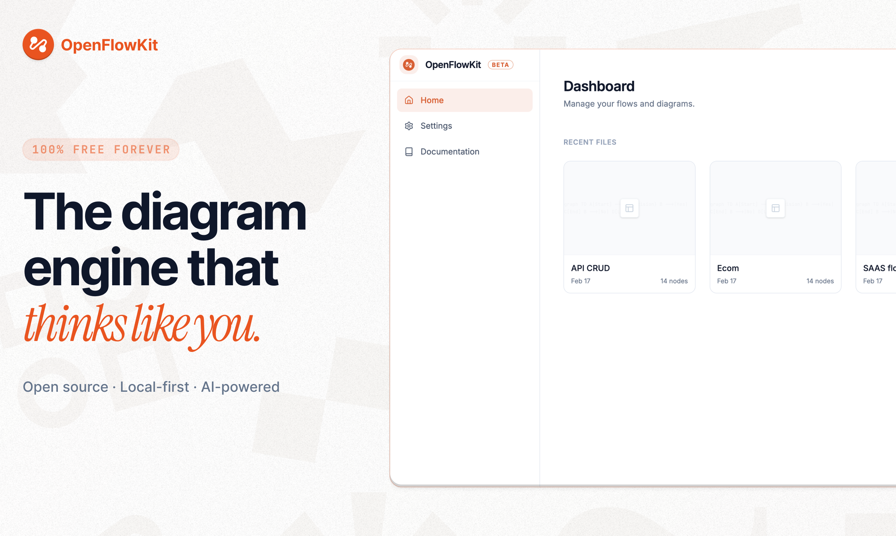
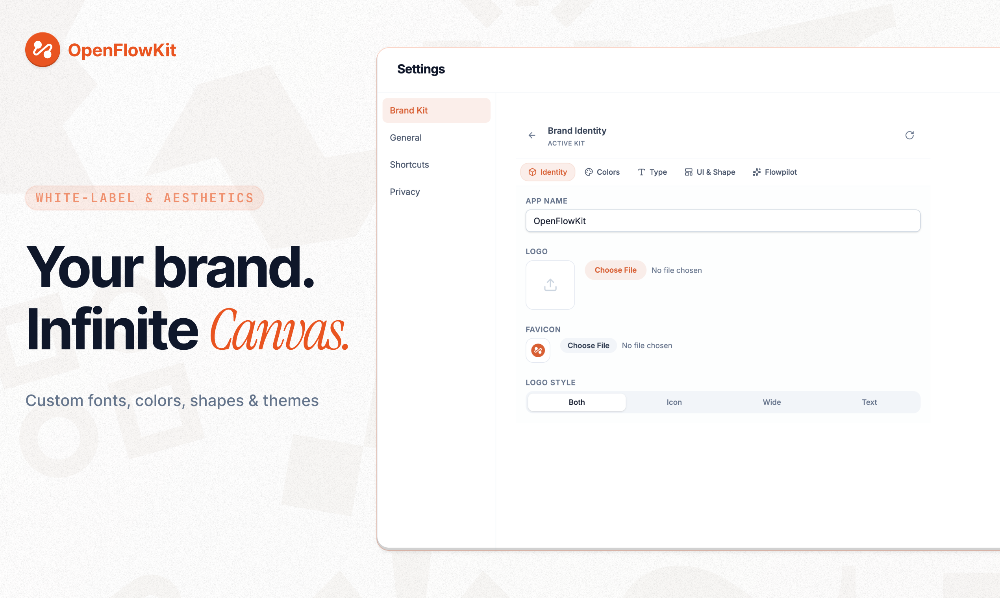
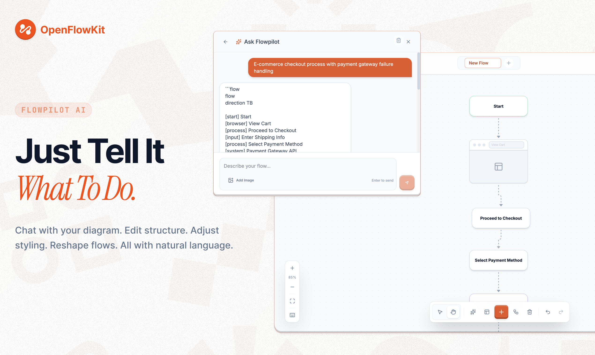
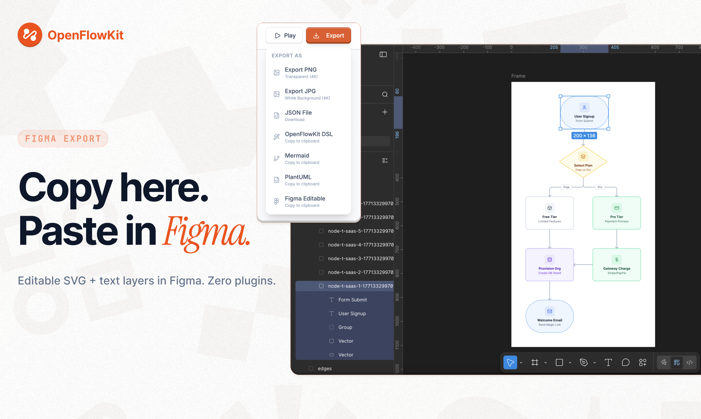
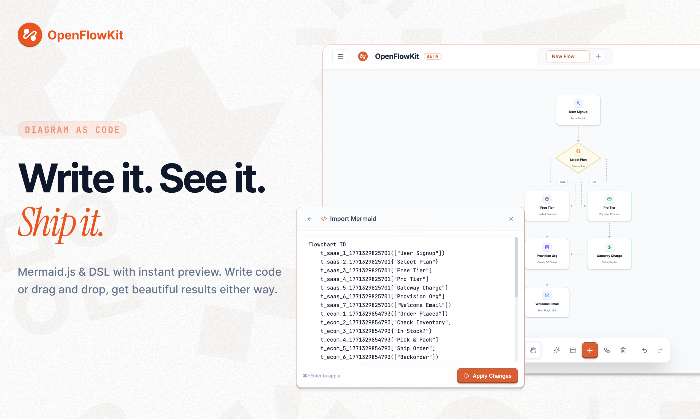
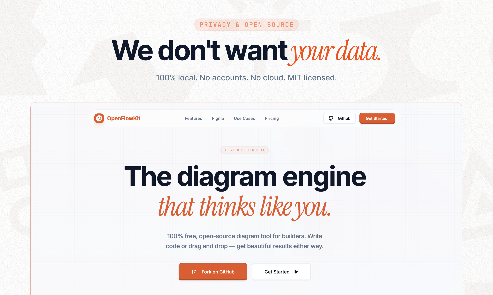

# OpenFlowKit ⚡️


[](https://www.producthunt.com/products/openflowkit)

**The Open-Source, White-Label Diagramming Engine.**  
Built for developers and technical teams who want diagrams that actually look good. **100% Free & MIT Licensed.**

OpenFlowKit is a professional-grade canvas that combines the power of **React Flow**, **Diagram-as-Code**, and **AI generation** into one privacy-first, fully white-labelable tool — now with full **internationalization support**.



## 📋 Table of Contents
- [Why OpenFlowKit?](#-why-openflowkit)
- [Key Features](#-key-features)
- [Flowpilot — AI Generation](#-flowpilot--ai-diagram-generation)
- [Node Types](#-node-types)
- [Export Formats](#-export-formats)
- [Internationalization](#-internationalization-i18n)
- [Architecture](#-architecture--project-structure)
- [Getting Started](#-getting-started)
- [Testing & Quality](#-testing--quality)
- [Extensibility & Self-Hosting](#-extensibility--self-hosting)
- [Contributing](#-contributing)
- [License](#-license)

---

## 🌟 Why OpenFlowKit?

- **MIT Licensed**: 100% free to use, fork, and integrate into commercial products.
- **Pure White-Label**: The UI dynamically absorbs **YOUR** brand tokens. It looks like your product, not a third-party plugin.
- **Diagram-as-Code Native**: Full support for **Mermaid.js** and the **OpenFlow DSL V2**.
- **High-Fidelity UX**: Glassmorphism, smooth animations, and CAD-inspired aesthetics out of the box.
- **Privacy First**: Local-first architecture. Your data never leaves your device.
- **BYOK AI**: Bring your own API key for 7 providers — Gemini, OpenAI, Claude, Groq, NVIDIA, Cerebras, Mistral, or any custom OpenAI-compatible endpoint.
- **Fully Internationalized**: Complete i18n support with English and Turkish — language persists across navigation via localStorage.

---

## 🔥 Key Features

### ⚪ White-Label Brand Engine
Don't just embed a tool—embed **your brand**. Our engine generates harmonious palettes from a single primary color:

- **Brand Kits**: Toggle between named identities — Wireframe, Executive, Dark Mode.
- **Dynamic Typography**: Native **Google Fonts** support (Inter, Roboto, Outfit, Playfair, Fira, and system fonts).
- **Design System Panel**: Fine-tune glassmorphism, corner radii, border weights, node padding, and edge styles from a unified panel.



### 🌍 Internationalization (i18n)
Full multi-language support powered by **react-i18next**:

- **Languages**: English (full) · Turkish (full) · German, French, Spanish, Chinese, Japanese (UI-only)
- **Persistent Selection**: Chosen language saves to `localStorage` and restores on every page load/navigation — no resets.
- **Bundled Translations**: All translation files are imported at build time (no runtime HTTP fetches that could fail) ensuring instant availability.
- **Scope**: Every UI surface is translated — node properties, edge operations, dialogs, toolbar, navigation, settings, documentation, and more.
- **Language Selector**: Globe icon in the nav bar — switch languages live without a page reload.

### 🤖 Flowpilot — AI Diagram Generation
Generate entire diagrams from a text prompt. Bring your own API key — your key never leaves your device.

**Supported providers:**

| Provider | Free Tier | Key Prefix | Notes |
|---|---|---|---|
| **Gemini** | ✅ Yes | `AIzaSy...` | Google AI Studio — no credit card needed |
| **Groq** | ✅ Yes | `gsk_...` | Blazing fast · Llama 4 |
| **Cerebras** | ✅ Yes | `csk-...` | 2,400 tok/s on WSE-3 |
| **Mistral** | ✅ Yes | `azy...` | European AI · Codestral · Le Chat |
| **NVIDIA NIM** | ✅ Credits | `nvapi-...` | DeepSeek-V3.2, Llama 4 |
| **OpenAI** | 💳 Paid | `sk-...` | GPT-5 family |
| **Claude** | 💳 Paid | `sk-ant-...` | Anthropic Sonnet/Opus |
| **Custom** | — | any | Any OpenAI-compatible endpoint (Ollama, LM Studio, Together.ai…) |

- **Natural Language → Diagram**: Describe a workflow in plain English, get a complete flowchart.
- **Privacy First**: API keys stored locally, never sent to our servers.
- **OpenFlow DSL V2**: AI outputs type-safe DSL, auto-rendered on canvas.



### 🖌️ Native Figma Export
Generate clean, structured SVGs that behave like native Figma layers.
- **Vector Fidelity**: Perfect rounded corners and gradients.
- **Editable Text**: Labels export as text blocks, not paths.
- **One-Click Copy**: Paste directly into Figma with Cmd+V.



### 🛠 Advanced Diagram-as-Code
First-class support for **Mermaid.js** and the **OpenFlow DSL V2**.
- **Mermaid Support**: Flowcharts, State Diagrams, and Subgraphs.
- **Live Two-Way Sync**: Edit visually, watch the code update. Edit code, watch the canvas update.
- **Auto-Layout**: Industrial-grade layout algorithms powered by **ELK.js**.
- **OpenFlow DSL V2**: Type-safe syntax with explicit node IDs, styling, groups, and edge customization.



### ⌨️ Command Bar (Cmd+K)
A Spotlight-style command palette for power users:
- **Quick Actions**: Add nodes, run auto-layout, export, toggle panels — without leaving the keyboard.
- **Fuzzy Search**: Find commands, templates, and settings instantly.
- **Keyboard First**: Full shortcut support (Undo, Redo, Copy, Paste, Delete, Select All, Alt+Drag to duplicate).

### 🎬 Playback & Presentation Mode
Step through diagram construction like a slideshow:
- **Build-Order Replay**: Watch nodes and edges appear in the order they were created.
- **Speed Controls**: Adjust playback speed or step through manually.
- **Presentation Ready**: Perfect for walkthroughs, demos, and documentation.

### 📦 Starter Templates
Hit the ground running with **5 production-ready templates**:
- SaaS Subscription Flow
- E-commerce Fulfillment Pipeline
- AI Content Moderation System
- Smart Support Triage
- CI/CD DevOps Pipeline

### 📸 Snapshots & Version History
- **Manual Snapshots**: Save and restore named versions of your work.
- **Local Storage**: Everything stays on your device.

### 🧮 Alignment & Distribution
- **Align**: Left, center, right, top, middle, bottom.
- **Distribute**: Even horizontal/vertical spacing across selected nodes.
- **Smart Edge Routing**: Automatic path optimization to avoid node overlaps.

### ⚛️ Built on React Flow
Leveraging the industry standard for node-based UIs, OpenFlowKit is highly performant and infinitely extensible.

---

## 🧩 Node Types

OpenFlowKit supports **10+ node types** out of the box:

| Node Type | Description | Shapes Available |
|-----------|-------------|------------------|
| **Process** | Standard workflow step | Rounded, Rectangle, Capsule, Circle, Ellipse, Diamond, Hexagon, Parallelogram, Cylinder |
| **Decision** | Branching logic (if/else) | Diamond (default), all shapes |
| **Start** | Flow entry point | Capsule (default), all shapes |
| **End** | Flow termination | Capsule (default), all shapes |
| **Custom** | Freestyle node | All shapes |
| **Section / Group** | Container for grouping related nodes | Rounded rectangle with dashed border |
| **Annotation** | Sticky-note style comments | Folded corner card |
| **Text** | Standalone text labels | No border / transparent |
| **Image** | Embed images into diagrams | Rounded card |
| **Swimlane** | Lane-based process organization | Horizontal lanes |
| **Browser** | Browser mockup wireframe | Chrome-style frame |
| **Mobile** | Mobile device wireframe | Phone-style frame |

Every standard node supports:
- **9 color themes**: Slate, Blue, Emerald, Red, Amber, Violet, Pink, Yellow, Cyan
- **120+ Lucide icons** or custom icon URLs
- **Markdown labels** with bold, italic, links, and inline code
- **Font customization**: Family, size, weight, and style per node (or inherited from Design System)

---

## 📤 Export Formats

| Format | Type | Description |
|--------|------|-------------|
| **SVG** | File download | Scalable vector graphic |
| **PNG** | File download | Raster image |
| **JPG** | File download | Compressed image |
| **Figma** | Clipboard copy | Editable SVG layers (paste with Cmd+V) |
| **Mermaid** | Clipboard copy | Mermaid.js syntax |
| **PlantUML** | Clipboard copy | PlantUML syntax |
| **OpenFlow DSL** | Clipboard copy | Type-safe DSL V2 |
| **JSON** | File save | Full diagram state (nodes, edges, styles) |

---

## 🌍 Internationalization (i18n)

OpenFlowKit ships with a production-ready i18n system built on **react-i18next**.

### Supported Languages

| Language | Code | Coverage | Status |
|----------|------|----------|--------|
| English | `en` | Full app + docs | ✅ Complete |
| Turkish | `tr` | Full app + docs | ✅ Complete |
| German | `de` | UI only | 🔄 Partial |
| French | `fr` | UI only | 🔄 Partial |
| Spanish | `es` | UI only | 🔄 Partial |
| Chinese | `zh` | UI only | 🔄 Partial |
| Japanese | `ja` | UI only | 🔄 Partial |

### How It Works

- **Bundled at build time**: Translations are imported as JSON modules — no runtime fetches, no 404s, no fallbacks.
- **Language detection order**: `localStorage` → browser `navigator` language.
- **Persistence**: Your selection writes to `localStorage` under the key `i18nextLng` and is restored on every page navigation.
- **Live switching**: The `LanguageSelector` component switches languages without any page reload.
- **Translation files**: Located in `src/i18n/locales/{lang}/translation.json`.

### Adding a New Language

```bash
# 1. Copy the English base file
cp src/i18n/locales/en/translation.json src/i18n/locales/de/translation.json

# 2. Translate the values (keys stay in English)

# 3. Register in config
# src/i18n/config.ts → add: import deTranslation from './locales/de/translation.json';
#                            resources: { de: { translation: deTranslation } }

# 4. Add to LANGUAGES array in LanguageSelector.tsx
```

---

## 🏗️ Architecture & Project Structure

Built for performance and extensibility:

- **Core**: [React Flow 11](https://reactflow.dev/) + [Vite 6](https://vitejs.dev/)
- **State**: [Zustand](https://zustand-demo.pmnd.rs/) for high-performance persistence
- **Language**: [TypeScript 5.8](https://www.typescriptlang.org/) — strict, zero type errors
- **Styling**: [Tailwind CSS 4](https://tailwindcss.com/) + CSS Design Tokens
- **i18n**: [react-i18next](https://react.i18next.com/) + bundled JSON translations

### Project Map

```bash
OpenFlowKit/
├── src/
│   ├── components/
│   │   ├── properties/          # Property panels (nodes/edges/canvas)
│   │   ├── SettingsModal/       # Settings screens + AI provider sections
│   │   ├── custom-nodes/        # Browser/Mobile/Wireframe/Icon nodes
│   │   ├── custom-edge/         # Custom edge render helpers
│   │   ├── command-bar/         # Cmd+K command palette views
│   │   ├── docs/                # Built-in docs + docs chatbot
│   │   ├── flow-canvas/         # Canvas orchestration subcomponents
│   │   ├── home/                # Dashboard/sidebar/settings home views
│   │   ├── toolbar/             # Toolbar subcomponents
│   │   ├── top-nav/             # Top nav subcomponents
│   │   ├── landing/             # Landing page sections
│   │   ├── ui/                  # Branded UI primitives
│   │   ├── FlowEditor.tsx       # Main diagram orchestrator
│   │   ├── FlowCanvas.tsx       # React Flow canvas wrapper
│   │   ├── CommandBar.tsx       # Spotlight-style command palette
│   │   ├── CustomNode.tsx       # Universal node renderer
│   │   └── CustomEdge.tsx       # Styled edge renderer
│   ├── config/
│   │   └── aiProviders.ts       # AI provider registry + model metadata
│   ├── hooks/
│   │   ├── flow-operations/        # Flow operation modules (layout/selection/canvas ops)
│   │   ├── flow-editor-actions/    # Editor action modules (export/templates/history)
│   │   ├── node-operations/        # Node operation modules
│   │   ├── useFlowOperations.ts    # Composed flow operation hook
│   │   ├── useFlowEditorActions.ts # Composed editor actions hook
│   │   ├── useFlowEditorCallbacks.ts # Editor callback wiring
│   │   ├── useFlowEditorUIState.ts # Editor panel/view state orchestration
│   │   ├── useFlowHistory.ts       # Undo/Redo state + controls
│   │   ├── useAIGeneration.ts      # Flowpilot AI integration
│   │   ├── useSnapshots.ts         # Snapshot version history
│   │   ├── useClipboardOperations.ts # Clipboard copy/cut/paste operations
│   │   └── useDesignSystem.ts      # Active design-system token access
│   ├── i18n/
│   │   ├── config.ts            # react-i18next setup (bundled imports)
│   │   └── locales/
│   │       ├── en/translation.json  # English (full coverage)
│   │       ├── tr/translation.json  # Turkish (full coverage)
│   │       └── ...                  # de/fr/es/zh/ja
│   ├── lib/
│   │   ├── flowmindDSLParserV2.ts  # OpenFlow DSL V2 parser
│   │   ├── mermaidParser.ts        # Mermaid.js → nodes/edges
│   │   ├── observability.ts        # Global error/telemetry hooks
│   │   ├── analytics.ts            # PostHog integration
│   │   └── types.ts                # Shared type definitions
│   ├── services/
│   │   ├── aiService.ts            # Multi-provider AI client
│   │   ├── geminiService.ts        # Gemini-specific implementation
│   │   ├── elkLayout.ts            # ELK.js auto-layout engine
│   │   ├── smartEdgeRouting.ts     # Edge path optimization
│   │   ├── figmaExportService.ts   # Figma-compatible SVG export
│   │   ├── openFlowDSLExporter.ts  # Nodes/edges → DSL V2
│   │   └── templates.ts            # Starter templates
│   ├── store/
│   │   ├── actions/                # Zustand action slices
│   │   ├── defaults.ts             # Default state contracts
│   │   └── types.ts                # Store state types
│   ├── store.ts                    # Store composition + persist wiring
│   └── theme.ts                 # Color palettes & design tokens
├── e2e/
│   └── smoke.spec.ts              # Playwright smoke tests
├── playwright.config.ts           # Playwright config (Chromium project + webServer)
├── docs/
│   ├── en/                      # English documentation
│   └── tr/                      # Turkish documentation
├── public/                      # Static assets & provider logos
└── index.css                    # Tailwind & custom styling
```

---

## 🔌 Extensibility & Self-Hosting

OpenFlowKit is **local-first** for maximum privacy. It's also architected to be easily extended with a backend.

### 1. Connecting a Database
Snapshot/version storage is isolated in `src/hooks/useSnapshots.ts`.
Main editor/session state persistence is handled in the Zustand store (`src/store.ts`) with store defaults/actions under `src/store/`.
To add Supabase, Firebase, or your own API, replace the local persistence touchpoints with your API layer.

### 2. Adding Authentication
- **Header:** `TopNav.tsx` has a dedicated slot for a Sign In button.
- **Dashboard:** `HomePage.tsx` can gate content based on auth state.

### 3. Analytics
Privacy-friendly analytics via PostHog.
- `VITE_POSTHOG_KEY` is loaded from `.env.local` (gitignored).
- If you fork this repo, analytics will not fire until you add your own key.

### 4. AI Integration (BYOK)
The AI layer (`useAIGeneration.ts`) and provider clients (`services/aiService.ts`, `services/geminiService.ts`) are isolated modules.
- **BYOK**: Users add their own API key in Settings → Flowpilot. Keys are stored in `localStorage` only.
- **Multi-Provider**: Gemini, OpenAI, Claude, Groq, NVIDIA, Cerebras, Mistral, OpenRouter, or any OpenAI-compatible custom endpoint.
- **Swap Providers**: Select a new provider in-app — no code changes required.



---

## 🚀 Getting Started

1. **Clone the repository**
   ```bash
   git clone https://github.com/Vrun-design/OpenFlowKit.git
   cd OpenFlowKit
   ```

2. **Install & Launch**
   ```bash
   npm install
   npm run dev
   ```

3. **Optional: Add AI features (BYOK)**  
   Go to **Settings → Flowpilot**, select your provider, and paste your API key.  
   Your key is stored locally — never sent to our servers.

4. **Run tests**
   ```bash
   npm test
   ```

## ✅ Testing & Quality

OpenFlowKit ships with three quality layers:

- **Lint**: static analysis and rules enforcement.
- **Unit/Integration**: Vitest + Testing Library.
- **E2E Smoke**: Playwright browser-level coverage for key canvas flows.

### Local commands

```bash
# Lint
npm run lint

# Unit + integration tests
npm test -- --run

# E2E smoke tests (headless)
npm run e2e

# E2E in headed mode (local debugging)
npm run e2e:headed

# Full CI-equivalent suite (tests + build + bundle budget)
npm run test:ci
```

### CI checks

- `npm run test:ci` for unit/integration/build/bundle budget.
- `npm run e2e:ci` for Playwright smoke coverage (Chromium).


## 🤝 Contributing

We are building the open standard for diagramming. PRs for new Mermaid features, node types, AI optimizations, or new language translations are welcome!

- **Found a bug?** Open an issue.
- **Want a feature?** Start a discussion or open a PR.
- **Want to add a language?** See the [Adding a New Language](#adding-a-new-language) section.
- **Want to be featured?** Report bugs, suggest features, or submit PRs to get a shoutout in our Special Thanks section!
- **Love the tool?** ⭐ **Star this repo!** It helps us reach more developers.

---

## 🌍 Special Thanks

OpenFlowKit is now global and more powerful! A massive shout-out to our community:

- **[Yunus Emre Alpuş](https://github.com/YunusEmreAlps)** for leading the internationalization (i18n) effort and providing the initial Turkish localization. His contributions paved the way for our expansion into Spanish, German, French, Japanese, and Chinese.
- **[Naman Dhakad](https://github.com/namandhakad712)** for integrating **Mistral AI** as a Flowpilot provider, expanding our AI ecosystem and improving the developer experience across all providers.
- **[marsender](https://github.com/marsender)** for reporting 3 bugs and helping us improve the user experience and stability of the app!

---

## 📄 License

MIT © [Varun](https://github.com/Vrun-design)
