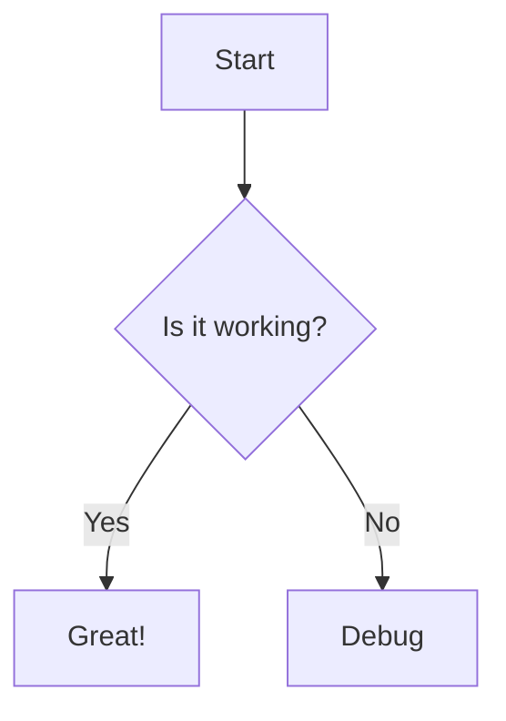

OpenFlowKit includes Mermaid import, editing, and export paths, but it should be treated as a compatibility workflow, not the editor's only source of truth.

## What Mermaid support is for

Use Mermaid support when:

- you already have Mermaid diagrams in docs or repos
- you want to keep diagrams close to Markdown workflows
- you want to move between Mermaid and a visual editor

## Mermaid in Studio

The Studio code rail has a dedicated **Mermaid** mode. From there you can:

- view Mermaid generated from the current canvas
- edit Mermaid directly
- apply the parsed graph back into the editor

When parsing fails, the Studio panel surfaces validation feedback and diagnostics.

## Mermaid export

The export menu can copy Mermaid text for the current graph to the clipboard.

## Fidelity expectations

Mermaid round-tripping is useful, but not every OpenFlowKit concept maps perfectly. Be careful with:

- highly visual hand-tuned layouts
- provider-specific architecture icon presentation
- some family-specific semantics that are richer in the native graph model

If exact recovery matters, export JSON alongside Mermaid.

## Best workflow

For teams already using Mermaid:

1. import or paste Mermaid
2. refine visually in OpenFlowKit
3. export Mermaid again if the downstream system still needs it
4. keep JSON as the editable master backup

1.  Click the **"Import"** button in the toolbar.
2.  Select **"Mermaid"**.
3.  Paste your code snippet.

### Supported Diagram Types
Currently, FlowMind optimizes for:
*   **Flowcharts** (`graph TD`, `graph LR`)
*   **Sequence Diagrams** (Partial support via conversion)

## Exporting to Mermaid

You can also export any FlowMind diagram *back* to Mermaid syntax.
This is perfect for embedding diagrams in GitHub `README.md` files or Notion documents.

1.  Open the **Code Panel** (bottom panel).
2.  Switch to the **"Mermaid"** tab.
3.  Copy the generated code.
