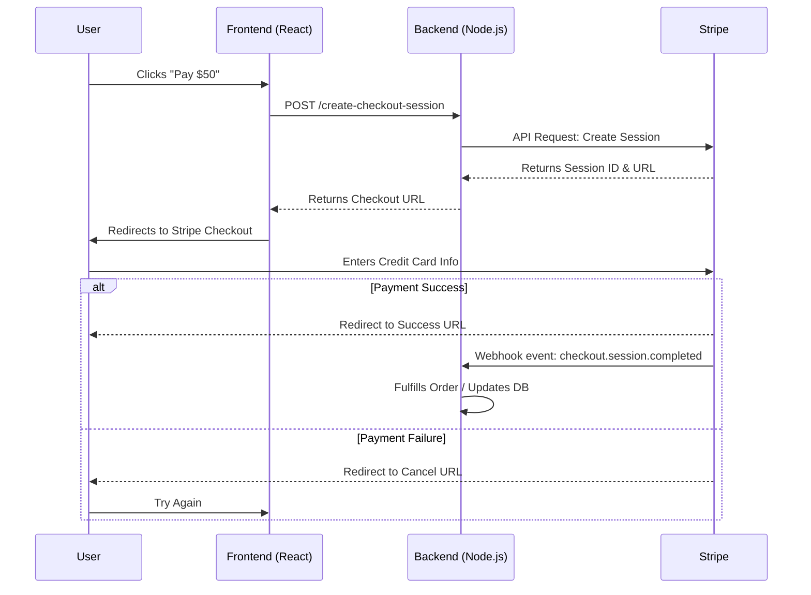

Payment systems are one of the best use cases for OpenFlowKit because they mix clear business stages with asynchronous branches, retries, and exception handling.

## What a useful payment diagram should include

Do not stop at the happy path. Most payment diagrams need:

- entry event
- authorization or charge attempt
- success and failure branches
- retry logic
- manual review path
- customer notification path
- final account state

## Suggested node pattern

For a typical subscription or checkout diagram:

- `start` for invoice due or checkout initiated
- `process` for charge, webhook handling, notifications, and retries
- `decision` for gateway outcomes
- `end` for terminal account states

## Example prompt

```text
Create a payment recovery flow for a SaaS subscription.
Include invoice due, charge attempt, charge success decision,
smart retries, request updated card, manual fraud review,
customer notification, subscription active, and account downgrade.
```

## Why this works well in OpenFlowKit

- branch labeling is easy on edges
- auto layout cleans up decision-heavy graphs
- JSON export gives you a high-fidelity editable backup
- Mermaid and PlantUML export help when finance or platform teams need docs-friendly formats

## Recommended review pattern

After drafting:

1. label every branch edge
2. verify timeout and retry behavior explicitly
3. add notes for webhook or gateway dependencies
4. save a manual snapshot before larger revisions

- **Shareability**: Everyone from the PM to the backend engineer needs to see the same flow.
- **Clarity**: Mapping out happy paths, failures, and webhook retries visually is much easier than reading through Stripe API documentation.
- **Speed**: Use the [Command Center](/docs/en/command-center) and AI to generate the boilerplate flow in seconds.

## Example: Stripe Checkout Flow

Here is a common Stripe Checkout implementation mapped out. Notice how we use different node shapes to distinguish between client-side actions, server-side actions, and third-party API calls.



## Tips for Better Payment Diagrams

1. **Use Swimlanes**: Group actions by responsibility. Put the User in one lane, your API in another, and the Payment Processor (Stripe/PayPal) in a third.
2. **Color Code**: Use green for happy paths (success), red for failure states (declines/insufficient funds), and gray for retries.
3. **Explicit Callouts**: Use the **Annotation Node** to document exact webhook payloads or secret keys needed at specific steps.

## AI Prompt Example

To generate a similar flow using [Ask Flowpilot](/docs/en/ask-flowpilot):

> `"Generate a flowchart showing a subscription payment flow using Braintree. Include the client requesting a client token, the server generating it, the user submitting a nonce, and the final server-side transaction creation. Show both success and failure branches."`

Need to present this to your team? Try the [Playback History](/docs/en/playback-history) feature to walk through the payment sequence step-by-step.
